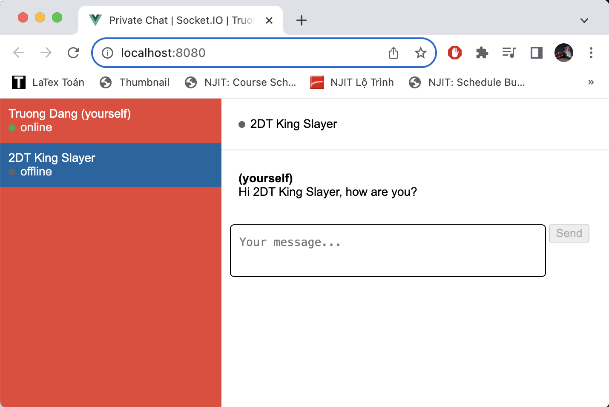
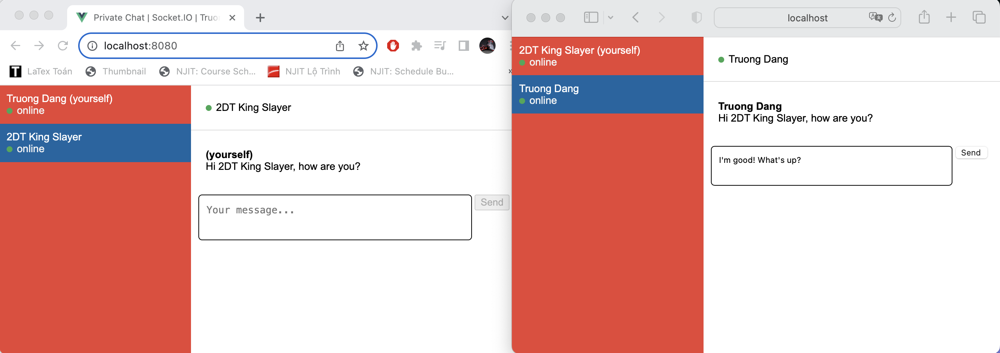

# Private Chat with Socket.IO by Truong Dang

### Account 1 is online & Account 2 is offline

The status of the two accounts are updated.



### Account 1 is online & Account 2 is online

The status of the two accounts are updated. When account 2 is signed in, the past messages are still there.



Detail instructions can be found below:

- [Part I](https://socket.io/get-started/private-messaging-part-1/): initial implementation
- [Part II](https://socket.io/get-started/private-messaging-part-2/): persistent user ID
- [Part III](https://socket.io/get-started/private-messaging-part-3/): persistent messages
- [Part IV](https://socket.io/get-started/private-messaging-part-4/): scaling up

## Running the frontend

```
npm install
npm run serve
```

### Running the server

```
cd server
npm install
npm start
```
